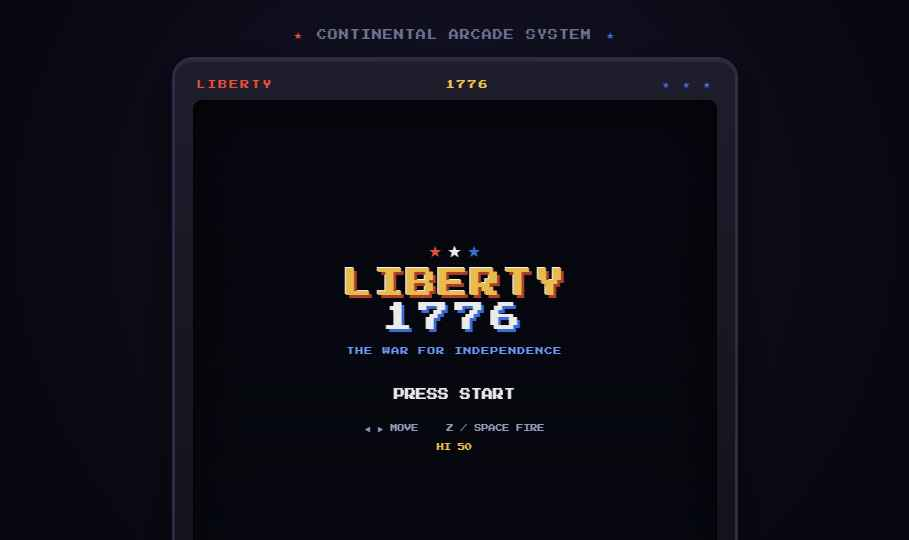
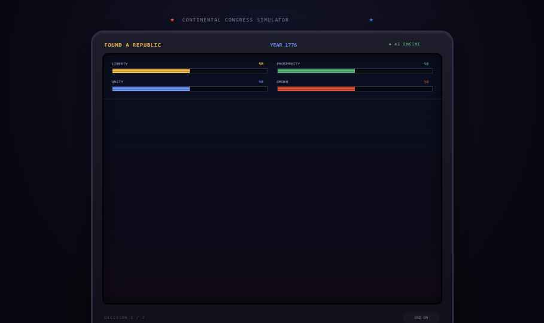

# Summer into AI 2026: Found a Republic

Theme 1 dropped and I kept thinking about what actually made NES games stick. Not just the shooting — the choices. What if the founding of America booted from a cartridge, and the cartridge argued back?

**Found a Republic** is an 8-bit civics simulator. You're at the helm of a new nation in 1776. A pixel advisory council hands you real founding-era dilemmas and you decide — free press or order, roads or schools, strong executive or committee rule. Claude reasons out the consequences live and prints them as a period newspaper headline. Your decisions shift four meters: Liberty, Prosperity, Unity, and Order. Let any one of them hit zero and the republic fractures early. Seven decisions in, Claude writes your personal legacy — a different verdict of history every single time.

## How the AI works

Every turn is a live call to Claude. It doesn't just pick from a list — it reads your current meter state, your year, and your choice, then generates a headline, a consequence, and your *next* dilemma adapted to where your republic is actually heading. The finale call writes a full textbook-style legacy based on every decision you made. No two playthroughs are the same.

If Claude is ever unreachable the game drops into demo mode silently — so it never breaks on someone trying it cold.

## What I was reacting to

I saw **Founderman** by Eric Rhea ([@advisoryhour](https://advisoryhour.substack.com/p/summer-into-ai-2026-megaman-1776)) turn the Founding Fathers into Megaman characters — Washington's charging brigade, Franklin's kite projectile. Really smart action framing. It made me want to try the opposite angle: same era, same cast, but you're the one making the decisions they argued about in real life. Less boss fight, more constitutional convention.

## How to play

- Click a choice
- Read the consequence in the newspaper
- Watch your four meters
- Seven decisions, then your legacy
- Don't let any pillar hit zero

## Where to play

**Demo:** [found-a-republic.vercel.app](https://found-a-republic.vercel.app)
**Code:** [github.com/GlimmerForge/summer-into-ai](https://github.com/GlimmerForge/summer-into-ai/tree/master/projects/week-01-8bit-america/demo-01-found-a-republic)

---

*Summer into AI 2026 · Theme 1: 8-Bit America · Competitor reference: Founderman by [@advisoryhour](https://advisoryhour.substack.com/p/summer-into-ai-2026-megaman-1776)*
