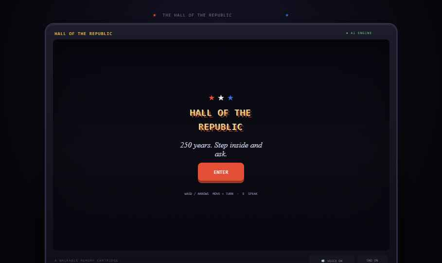
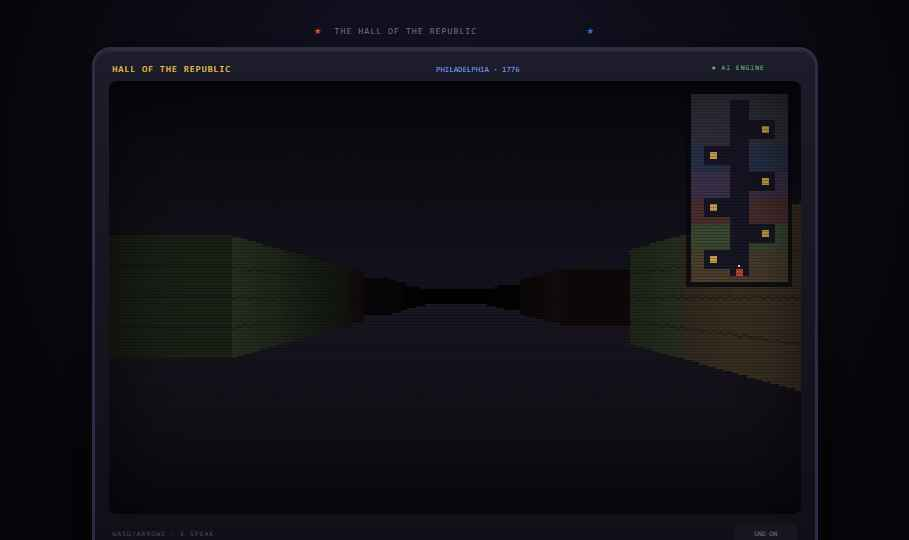
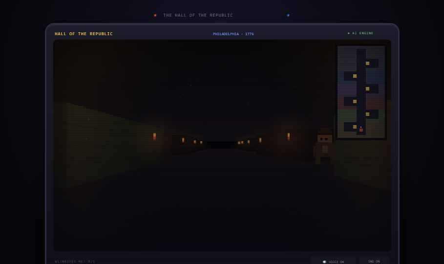
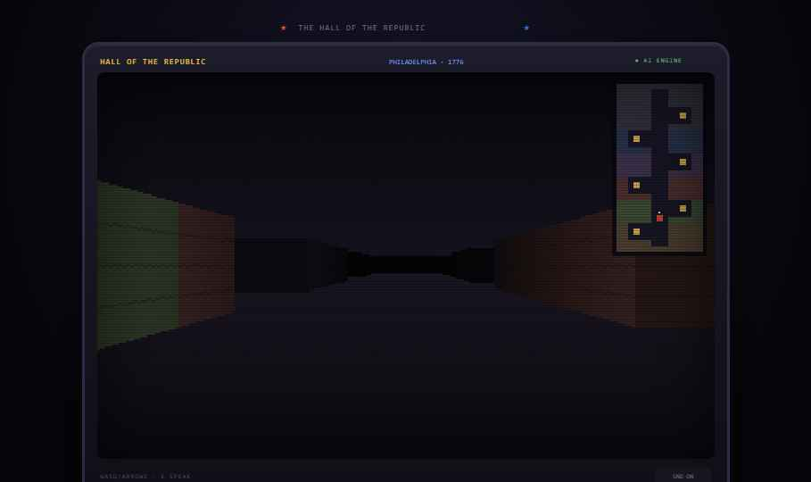

# Hall of the Republic

**Week 1 · Theme: 8-Bit America · Summer Into AI 2026**

A first-person Wolfenstein-style walk through 250 years of American history. Move through a pixel hall and encounter AI-voiced witnesses — a Revolutionary-era founder, a Civil War soldier, a suffragette, and more. Talk to them in free text; Claude generates their responses in character. Each witness speaks in a distinct cinematic voice via ElevenLabs (falls back to browser speech synthesis if no key is set). Wall plaques show real, verified historical facts.

> **Honesty note:** the witnesses' words are AI-generated historical impressions, not real quotations.

## AI Stack

| Feature | Service |
|---------|---------|
| Witness dialogue | Claude (`api/ai.js`) |
| Voice synthesis | ElevenLabs (`api/tts.js`) — falls back to browser TTS |
| Speech input | Browser Web Speech API (🎤 mic button) |

## Deploy to Vercel

1. Import `GlimmerForge/summer-into-ai` in Vercel
2. Set **Root Directory** to `projects/week-01-8bit-america/demo-03-hall-of-the-republic`
3. Add environment variables:
   - `ANTHROPIC_API_KEY = sk-ant-...` (required for dialogue)
   - `ELEVENLABS_API_KEY = ...` (optional — falls back to browser voices without it)
4. Deploy

## Files

| File | Purpose |
|------|---------|
| `index.html` | Self-contained deployable game |
| `support.js` | DC component runtime |
| `api/ai.js` | Claude serverless function — generates witness dialogue |
| `api/tts.js` | ElevenLabs serverless function — text-to-speech voices |
| `assets/boxart.png` | 1200×675 share image |
| `assets/icon.png` | 600×600 icon |
| `package.json` | Declares ESM for Vercel |
