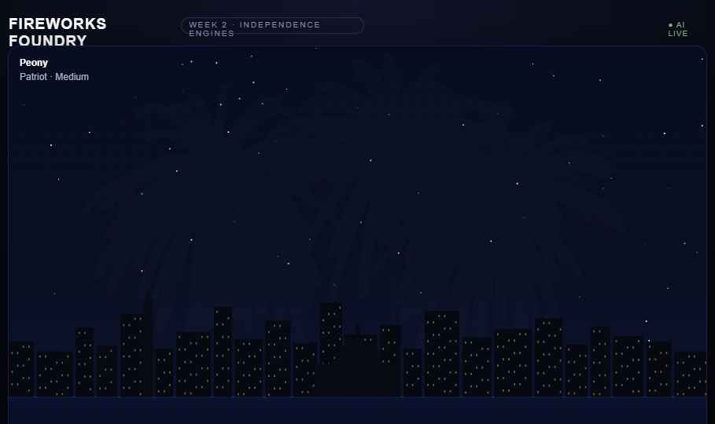
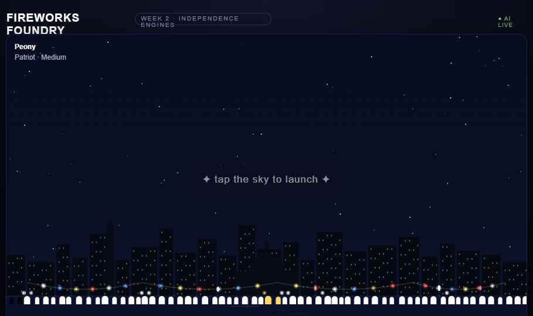
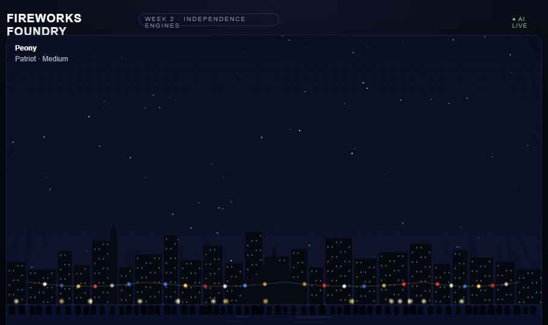

# Fireworks Foundry

**Week 2 · Theme: Red, White & Boom · Summer Into AI 2026**

A browser-based fireworks canvas with an AI director. Tap anywhere in the night sky to launch shells — mix 8 burst types and 7 color palettes, sync explosions to a live music beat, or hand control to Claude and let it choreograph a full cinematic show from a single sentence.

## How AI Powers It

Two live Claude calls drive the creative layer:

**AI Director** — type any vibe ("slow patriotic build into a gold finale", "surprise my wife for her birthday") and Claude generates a full choreographed show: a title card, three narration lines, a palette arc across the performance, a music track selection, and a finale word spelled out in fireworks particles at the climax.

**AI Inspire** — one-click combo suggestion. Claude picks a shell type + palette pairing and names it ("Patriot's Cascade", "Frost Crackle") then fires a preview burst so you see it immediately.

Both calls gracefully fall back to built-in presets if the API is unreachable, so the canvas always works.

## Features

- **8 shell types**: Peony, Chrysanthemum, Willow, Ring, Palm, Heart, Crackle, Strobe
- **7 palettes**: Patriot, Gold, Emerald, Sapphire, Rose, Ice, Rainbow
- **Beat mode**: fireworks sync to the music rhythm automatically
- **★ Finale**: full random barrage across the sky
- **📸 Poster**: saves a PNG of your current sky with a branded watermark
- **5 music tracks**: Fanfare, March, Anthem, Disco, Dreamy (Web Audio synth, no assets)
- American skyline backdrop — Washington Monument, Capitol dome, lit windows, string lights, crowd silhouette

## Deploy to Vercel

1. Import `GlimmerForge/summer-into-ai` in Vercel
2. Set **Root Directory** to `projects/week-02-red-white-boom/demo-02-fireworks-foundry`
3. Add environment variable: `ANTHROPIC_API_KEY = sk-ant-...`
4. Deploy

The AI badge shows **● AI LIVE** (green) after the first successful Claude call, **● AI READY** (grey) without a key.

## Files

| File | Purpose |
|------|---------|
| `index.html` | Self-contained deployable canvas |
| `api/ai.js` | Vercel serverless function — proxies prompts to Claude |
| `package.json` | Declares ESM for Vercel |
| `vercel.json` | Function timeout config |
| `assets/` | Screenshots and share images |
