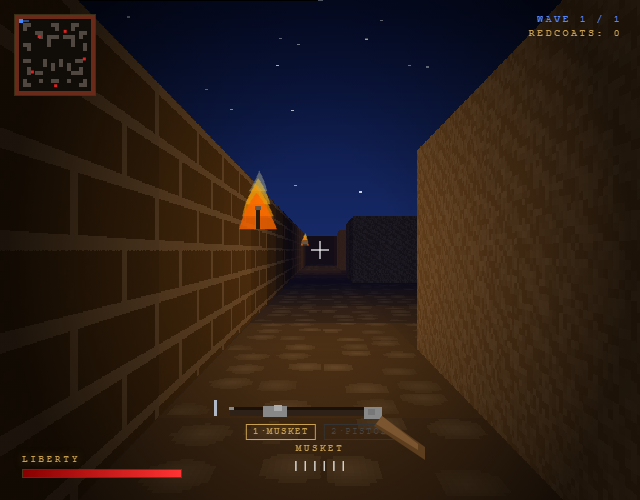
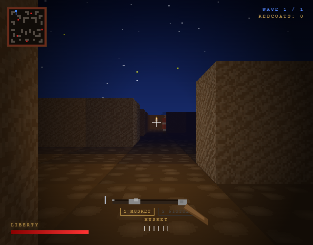
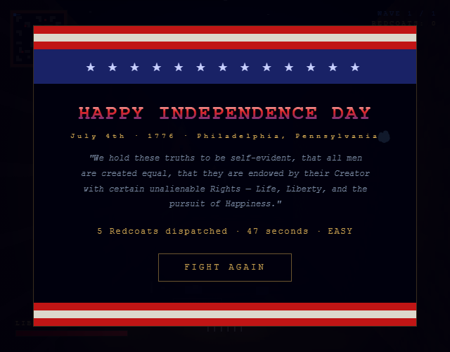

# Summer into AI 2026: Minuteman

**[COMPETITOR DEMO]** by [Author] ([@handle](https://[competitor].substack.com)) [one sentence on what they built and what was smart]. [One sentence on how it made you go a different direction].

**Minuteman** is a Doom-style FPS running in a single HTML file — no engine, no library, no server required. You play a Continental soldier on July 4th, 1776, holding the line against Redcoats and Hessians in torch-lit corridors. Your musket takes six manual steps to reload. Yankee Doodle plays on square-wave synth. When the last coat falls, fireworks.

## How the AI works

Claude didn't make API calls at runtime — it built the entire game through conversation. Here's what that produced in one sitting:

- **DDA raycaster** — a Doom-style 3D renderer using ImageData and Uint32Array pixel buffers, with perspective-correct floor casting and a per-column torch lighting system that flickers every frame
- **Procedural textures** — 64×64 brick, stone, and cobblestone canvases generated at startup; a 1024×256 sky panorama that scrolls as you turn
- **Six-phase musket reload** — bite cartridge → charge barrel → seat ball → ram → prime pan → ready, each phase with a canvas pivot animation and synthesized audio
- **Enemy state machine** — patrol, chase, and fire states per soldier, with 32-step line-of-sight ray marching, ramrod reload animations on the enemies themselves, and a crumple death sequence
- **Yankee Doodle** — the full song encoded as [note, duration] pairs, synthesized live as square-wave melody, harmony, sine bass, and marching drums through the Web Audio API

The game runs completely offline — no API key, no internet connection needed.

## How to play

- WASD — move, mouse — look (click canvas to capture pointer)
- Left click — fire musket
- R — reload (six steps, ~1.8 seconds for musket)
- Right click — bayonet charge (close range, instant)
- 1 / 2 — switch between musket and pistol
- E — pick up dropped weapons from fallen enemies
- Choose Easy (1 wave) / Normal (2 waves) / Hard (3 waves + boss) on the start screen

## Where to play

**Demo:** [[YOUR-URL].vercel.app](https://[YOUR-URL].vercel.app)
**Code:** [github.com/JStrait515/summer-into-ai](https://github.com/JStrait515/summer-into-ai/tree/master/projects/week-02-red-white-boom/demo-05-minuteman)

---

*Summer into AI 2026 · Theme 2: Red, White & Boom · Competitor reference: [COMPETITOR DEMO] by [@handle](https://[competitor].substack.com)*
