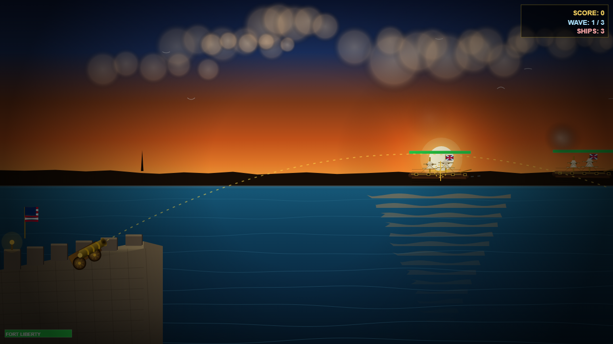
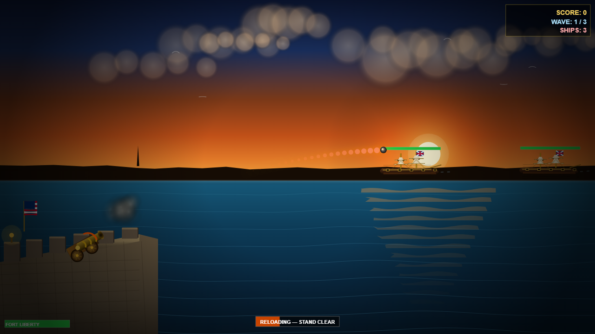
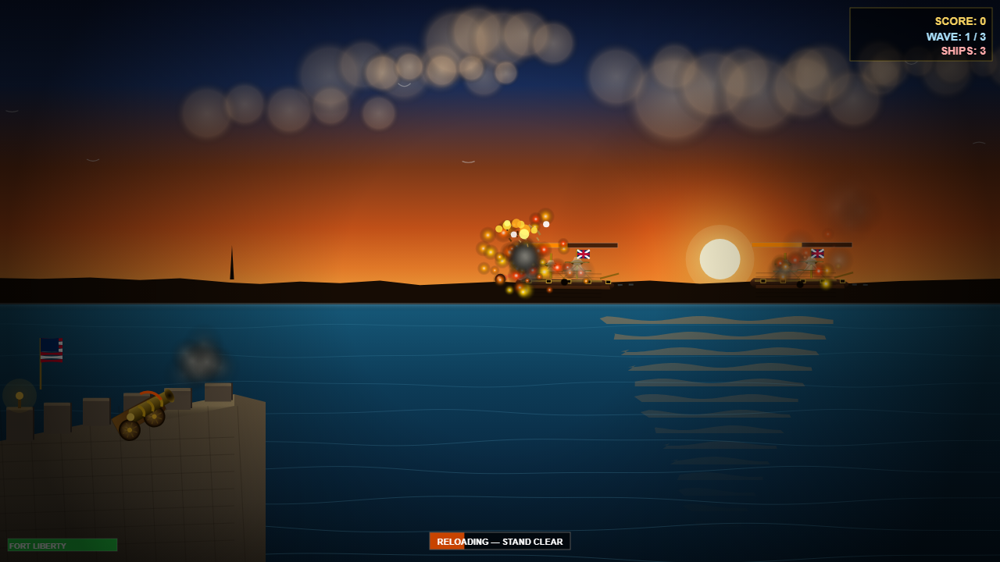

# Summer into AI 2026: The Patriot Gazette

**[COMPETITOR DEMO]** by [Author] ([@handle](https://advisoryhour.substack.com)) [one sentence on what they built and what was smart]. [One sentence on how it made you go a different direction].

**The Patriot Gazette** is a harbor defense artillery game set on July 4, 1776. You command a bronze cannon on the ramparts of Fort Liberty as the British fleet sails in from the horizon. Move your mouse anywhere on screen — the cannon auto-calculates the exact ballistic arc — then click to fire. British warships advance in three waves: sloops first, then frigates, then a man-of-war. Each class returns fire. Sink them all before they breach the harbor.

The new AI element is **streaming SSE narration**: Claude Haiku delivers live play-by-play commentary token-by-token via Server-Sent Events, triggered on every hit, sink, and harbor breach. The entire audio layer is procedural Web Audio API — rolling ocean waves with an LFO swell, a five-layer cannon boom with stone-echo reflections, an underwater gurgle as ships sink, stone crumble when the fort takes a hit, and a C–E–G–C bugle fanfare on victory. No sound files.

## How the AI works

Claude Haiku streams live battlefield narration in real time, triggered by every significant game event:

- **Streaming SSE narration** — each hit, sink, or breach POSTs to /api/narrate, a Vercel serverless function that calls client.messages.stream() and pipes each token back as text/event-stream. The browser reads chunks with response.body.getReader() and renders the correspondent's copy word-by-word as the model types it
- **Ballistic auto-range** — on every mousemove the game solves the quadratic ballistic equation to find the exact launch angle that lands the cannonball at your cursor; you aim by pointing, not by guessing the arc height

If the API is unreachable the game plays identically — narration stays silent. All gameplay logic is client-side.

## How to play

- **Move mouse** — point anywhere on the harbor; the cannon barrel auto-aims to the perfect ballistic angle
- **Click** — fire; the ball arcs to land exactly where your cursor is
- **HP bars** — green → orange → red above each ship; sloops sink in 2 hits, frigates 4, man-of-war 6
- **Enemy fire** — British ships return fire at Fort Liberty; watch the fort HP bar bottom-left
- **Three waves** — sloops → frigates → man-of-war; clear all three for the bugle fanfare and fireworks

## Where to play

**Demo:** [[your-vercel-url].vercel.app](https://patriot-gazette.vercel.app)
**Code:** [github.com/GlimmerForge/summer-into-ai](https://github.com/GlimmerForge/summer-into-ai/tree/master/projects/week-02-red-white-boom/demo-06-the-patriot-gazette)

---

*Summer into AI 2026 · Theme 2: Red, White & Boom · Competitor reference: [COMPETITOR DEMO] by [@handle](https://advisoryhour.substack.com)*
